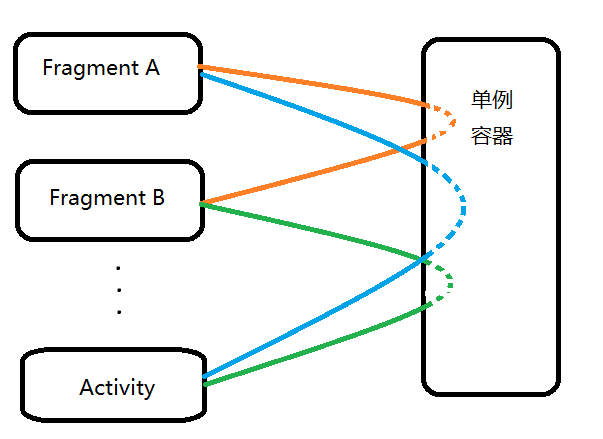

# Fishing--一个专注于Fragment通信的框架

## 描述
垂钓者(Fishingman)想要从池塘(Pond)里钓鱼。
现在如果一个Fragment要调用Activity中的方法，就好比Fragment是Fishingman,而Activity就是池塘。

## 必备知识

* 面向对象。

## 应用场景

* Fragment、Activity通信

## 示例

* sample2是一个完整的使用示例，不过其中不包括子线程回调的使用；
* sample3是一个不使用库中基类，直接使用库中接口实现，构建的沟通的示例；

## 使用

To be continued...

## License

    Copyright 2017, Halohoop

    Licensed under the Apache License, Version 2.0 (the "License");
    you may not use this file except in compliance with the License.
    You may obtain a copy of the License at

       http://www.apache.org/licenses/LICENSE-2.0

    Unless required by applicable law or agreed to in writing, software
    distributed under the License is distributed on an "AS IS" BASIS,
    WITHOUT WARRANTIES OR CONDITIONS OF ANY KIND, either express or implied.
    See the License for the specific language governing permissions and
    limitations under the License.